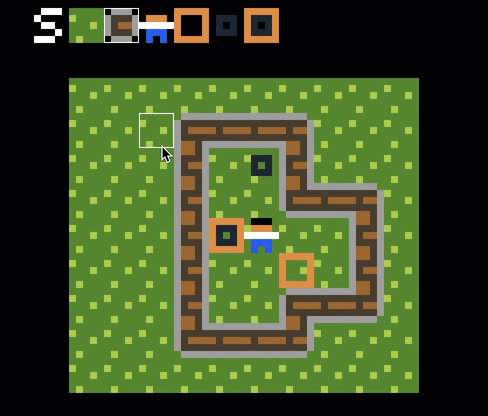

## Connected Textures



To use the connected textures feature, you need to add 2 additional objects that define
the borders and the corners of the wall. for example:

```
Wall
DARKBROWN
00000
00000
00000
00000
00000

Wall_BORDERS
BROWN
00000
0...0
0...0
0...0
00000

Wall_CORNERS
DARKBROWN
.000.
0...0
0...0
0...0
.000.
```

Currently, only a 1 pixel border is supported.

The algorithm works by using a bitmask of the neighbouring cells. Depending if a
neighbour is present, the bit is set:

```
     North: 1
      East: 2
     South: 4
      West: 8
North-West: 16
North-East: 32
South-East: 64
South-West: 128
```

Based on those textures, the algorithm calculates all possible 47 connected textures which
are compiled into a sprite-sheet that then is used accordingly when drawing the cell.


